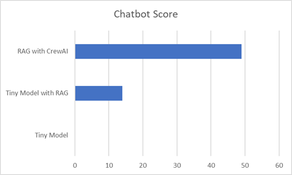

**A web-based AI assistant for Dungeons & Dragons**  
*Knowledge is Our Quest. Dungeons are Our Dataset.*

---

## Problem Statement

Dungeon Masters (DMs) spend hours prepping worlds, encounters, and rules lookups—only to improvise when players go off-script. Our project builds a **web-based AI assistant** that:

- **Cuts prep time** with on-demand NPCs, locations, and encounters.
- **Speeds up play** with instant, cited rules answers (RAG).
- **Remembers the story** with persistent campaign memory.
- **Fits modern tables** via Virtual Tabletop (VTT) integrations.

**Stack (at a glance):** LangChain for orchestration, **RAG** for grounded answers, and **CrewAI** for multi-agent workflows (lore, rules, encounters, notes).  
**Outcome:** Less grunt work, more ✨roleplay.

---

## D&D Market Cap (Back‑of‑the‑Envelope)

**Goal:** Estimate a standalone valuation if D&D were spun out as its own entity.

**Method (summarized):**
1) Start from Wizards of the Coast revenue (D&D + MTG).  
2) Attribute **~15–25%** to D&D.  
3) Apply a reasonable IP multiple (entertainment IP with strong community).  
4) Add intangibles (licensing, cultural impact, merch).

**Bottom line:** A **~$1–2B** range is plausible given the brand’s revenue share, IP strength, and community monetization potential.

> _Assumptions:_ These are directional ranges intended for scenario planning, not investment advice. Replace with updated filings/analyst splits if available.

---

## Code Evaluation Criteria (how we judged our build)

We scored the system across the dimensions below (1–5 scale), with short tests/demos for each:

1. **Answer Quality & Grounding** – factuality, citations, and retrieval precision/recall.  
2. **Latency & Throughput** – snappy UI response under typical session load.  
3. **RAG Retrieval Quality** – chunking strategy, embeddings, and re-ranking effectiveness.  
4. **Safety & Guardrails** – prompt hardening, refusal behavior, and jailbreak resistance.  
5. **Orchestration Robustness** – CrewAI task/hand-off reliability and error handling.  
6. **Observability** – logs, traces, and prompt/result capture for debugging.  
7. **DX & Maintainability** – clear folder structure, configs, and documentation.  
8. **VTT Readiness** – clean interfaces (tokens, stat blocks, flavor text) and idempotent pushes.  
9. **Reproducibility** – deterministic seeds where feasible; scripts for setup/ingest/evals.  
10. **UX** – streaming responses, markdown rendering, and minimal click count for common tasks.

---

## Code Breakdown

### Chatbot (RAG pipeline)
- **Ingestion:** loaders → text normalization → chunking → embeddings → vector store.  
- **Retrieval:** top‑k semantic search (+optional re-ranking) with **source citations**.  
- **Generation:** prompt templates tuned for rules, lore, and safety; **streaming** output.  
- **Memory:** per‑campaign/session summaries (episodic recap + key NPC/quest state).  
- **Guardrails:** banned content filters, tool-use constraints, and self-check steps.  
- **DevX:** `.env` configs, Make/CLI scripts for index rebuilds and quick evals.

### CrewAI (multi‑agent orchestration)
- **Rules Sage** – authoritative rules lookups (grounded + citations).  
- **Lore Master** – locations, NPCs, and narrative beats that fit tone & canon constraints.  
- **Encounter Designer** – balanced encounter drafts with hazards/objectives.  
- **Session Scribe** – recap + memory updates post-session.  
- **VTT Pusher** – converts content to tokens/blocks and pushes to the VTT API.  
- **Coordinator** – routes tasks, verifies outputs, and retries on errors.

## Chatbot Evaluation Criteria

🛠️ **1. Mechanical Lookup**

*Tests the bot’s ability to retrieve precise, structured mechanical data from the D&D 5e rules.*

1. What are the range, duration, and components of the Silence spell?
2. What is the Armor Class and Challenge Rating of an Owlbear?
3. What are the hit dice and starting equipment of a level 1 Barbarian?

📚 **2. Lore Recall**

*Tests the bot’s ability to recall official D&D lore (e.g., Forgotten Realms, planes, gods).*

1. Who is Lolth and what is her relationship to the Drow?
2. What city is considered the heart of trade in Faerûn?
3. What is the origin story of the Githyanki and Githzerai?

🔗 **3. Cross-Reference**

*Tests synthesis across multiple rules, classes, and situations.*

1. A level 5 Paladin uses Divine Smite with a critical hit from a magical longsword. How much damage is rolled?
2. If a Ranger uses the Hunter's Mark spell and also has a pet wolf from Beast Master archetype, how do attacks and bonuses stack during a single turn?
3. Can a multiclass Cleric/Sorcerer cast Spiritual Weapon and then Quickened Spell Fire Bolt in the same turn?

❓ **4. Ambiguity Resolution**

*Tests how the bot handles unclear or rules-as-intended vs. rules-as-written questions*

1. Can Counterspell be used on a creature using a magic item to cast a spell?
2. If I’m Invisible and cast Fireball, do I stay hidden?
3. Does a Barbarian’s Rage damage bonus apply to thrown weapons like handaxes?

🧠 **5. Contextual Integration**

*Tests the bot’s ability to reason with narrative + rules + situational tactics.*

1. I'm a level 7 Druid in wild shape (Dire Wolf) and about to fall into lava. What options do I have?
2. The party is fighting a ghost in a dimly lit crypt. What can a Cleric of Light Domain do to turn the tide?
3. I’m out of spell slots and low on HP, but I’m a Warlock with Armor of Agathys still active. How should I act on my next turn?

⚠️ **6. Adversarial / Fuzzy Recall**

*Tests the bot’s resilience to made-up names, close misnames, or incorrect assumptions*

1. What are the stats for a “Dracolisk”? (Trick: not in core 5e books.)
2. Can a “Dragonkin” use breath weapon twice per short rest? (Trick: “Dragonkin” isn't a core 5e creature/race — maybe meant “Dragonborn.”)
3. What’s the spell level of “Soul Bind”? (Trick: doesn’t exist in 5e; it’s from Pathfinder.)

🎨 **7. Creativity-Lore Blend**

*Tests whether the bot can creatively invent within D&D style and rules, consistent with lore.*

1. Invent a minor Feywild creature that can be used as a familiar. Give it 2 traits and a short background.
2. Design a new magical sword that has a drawback when used in the Shadowfell.
3. A new cleric domain called the Domain of Stars has emerged. Describe its divine tenets and a unique channel divinity.

## Chatbot Evaluation Graph

### Future Work

## D&D Market Cap
🧮 Step-by-Step Estimation Framework

**1. Start with Hasbro’s Financials**

* D&D is owned by Wizards of the Coast, which is a subsidiary of Hasbro Inc.
* Hasbro’s total market cap is around $8.9 billion.
* Wizards of the Coast generated $1.17 billion in revenue in 2024—this includes D&D and Magic: The Gathering.

**2. Estimate D&D’s Share of Wizards’ Revenue**

* While exact breakdowns aren’t public, analysts estimate D&D contributes ~15–25% of Wizards’ revenue.
* That puts D&D’s annual revenue in the ballpark of $175M–$300M.

**3. Apply a Revenue Multiple**

* For entertainment IPs, especially those with strong brand equity and community engagement, a 5–10x revenue multiple is reasonable.

**4. Factor in Intangibles**

* D&D’s cultural impact, licensing deals (e.g., Baldur’s Gate 3, Critical Role, Stranger Things), and merchandising add value.
* Kickstarter campaigns like The Legend of Vox Machina raised $11M+, and live shows like Dimension 20 sold out **Madison Square Garden**.

🧠 Bottom Line

A reasonable estimate for D&D’s market cap—if it were spun off—is likely in the **$1–2 billion** range, depending on how you value its IP, growth potential, and community engagement.
Would you like to build a Python model to simulate different valuation scenarios? We could factor in growth rates, licensing revenue, and even fanbase monetization.

## Chatbot Pricing Strategy

**1. Pricing Strategy**

📌 Recommended Monthly Price Point: $10–$15 per DM (Pro-tier)

Tiered pricing is key to capturing different segments of your audience.

🎯 Suggested Tiers:

Free / Freemium Tier: Limited usage (e.g., X interactions/month), great for adoption.

$9.99/month: Core features for casual DMs (auto-NPCs, rules lookup, encounter help).

$14.99–19.99/month: Power-user features for dedicated DMs or streamers (session summaries, homebrew integration, campaign tracking, etc.).

Enterprise/API licensing: White-labeled or integrated with Roll20 or other platforms.

💡 Why $10–$15/month?
That's consistent with what DMs already spend monthly on Roll20 Plus/Pro, D&D Beyond subscriptions, and digital assets. They’re willing to pay for tools that:

* Save time

* Enhance creativity

* Increase immersion and narrative flow

* Reduce prep work

### Demo

