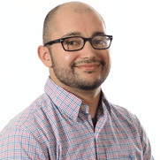

**Meet the team behind the D&D AI Assistant.**  
*Small team, big impact—driven by expertise and collaborative execution.* 🎲✨

---

## Our Team

::: {.grid}

::: {.g-col-12 .g-col-sm-6 .g-col-lg-3 .text-center}
{.rounded-circle .shadow style="width:160px;height:160px;object-fit:cover;"}
**Erik O'Riley**  
Knowledge Management Specialist at Becton, Dickinson and Company  
Experienced Project Manager with a demonstrated history of working in the information technology and services industry. Skilled in Python, AutoCAD, Storytelling, Design Thinking, PowerBI and Market Research. Strong professional with a Bachelor's degree focused in Mechanical Engineering from University of Missouri-Rolla.
:::

::: {.g-col-12 .g-col-sm-6 .g-col-lg-3 .text-center}
{.rounded-circle .shadow style="width:160px;height:160px;object-fit:cover;"}
**Alex Wissman**  
Role / Specialty  
Alex builds robust data pipelines and quick ML prototypes.
:::

::: {.g-col-12 .g-col-sm-6 .g-col-lg-3 .text-center}
{.rounded-circle .shadow style="width:160px;height:160px;object-fit:cover;"}
**Lowell Capobianco**  
MS in Business Analytics Candidate (UCSD) | Business Process | Veteran | SQL | Python | Statistics | Modeling  
As a Business Process Analyst at Northrop Grumman, I apply my project and people management skills to support the design, development, and implementation of business processes and systems for aerospace and defense solutions. I use my expertise in online analytical processing (OLAP) to perform data analysis and reporting for various stakeholders. Before joining Northrop Grumman, I served as a Surface Warfare Officer in the US Navy for six years, where I led and trained teams of sailors, managed shipboard operations, and participated in multiple missions and exercises. I am passionate about applying my engineering and military background to the field of business analysis, and I am always eager to learn new skills and technologies to enhance my performance and contribute to the mission and vision of Northrop Grumman.
:::

::: {.g-col-12 .g-col-sm-6 .g-col-lg-3 .text-center}
{.rounded-circle .shadow style="width:160px;height:160px;object-fit:cover;"}
**Juan Hernández Guizar**  
Aerospace / Digital Transformation  
Juan is a collaborative and resourceful professional with over five years of experience in the aerospace industry, specializing in product requirements, testing, digital transformation, and engineering management.
:::

:::