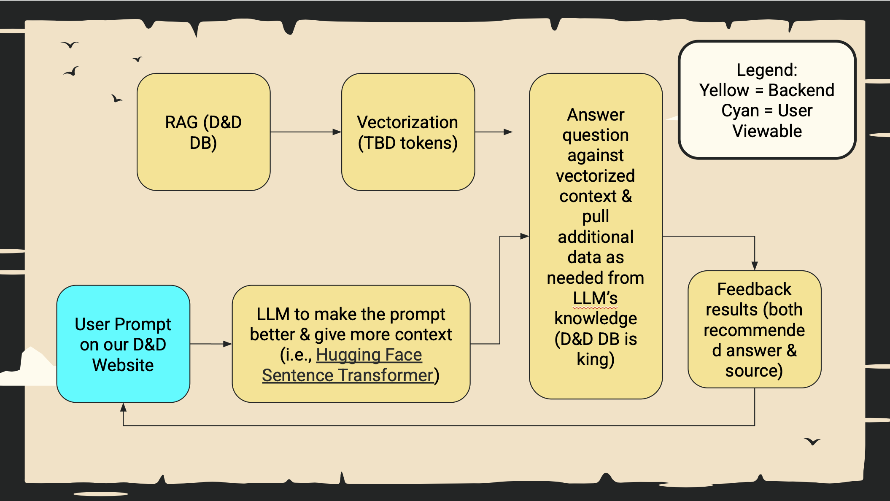

**A web-based AI assistant for Dungeons & Dragons**  
*Knowledge is Our Quest. Dungeons are Our Dataset.*

---

## ✨ What Does It Do?

The **D&D AI Assistant** is a Python-powered LLM chatbot that helps Dungeon Masters run streamlined sessions.  
Ask rules questions, roll dice, spawn NPCs, track combat, and even push tokens to your favorite VTT — all from one interface.

[Get Started Here!](<D&D Chat Bot.qmd>)

---

## 🏗️ Architecture Overview

The diagram below sketches the high‑level flow of data between components—in other words, who talks to whom when you ask the assistant anything you like. 🎲🚀

{
  fig-alt="High‑level system architecture for the D&D AI Assistant"
  fig-cap="Figure&nbsp;2. Behind‑the‑scenes: how the assistant pieces fit together."
  width=90%
}